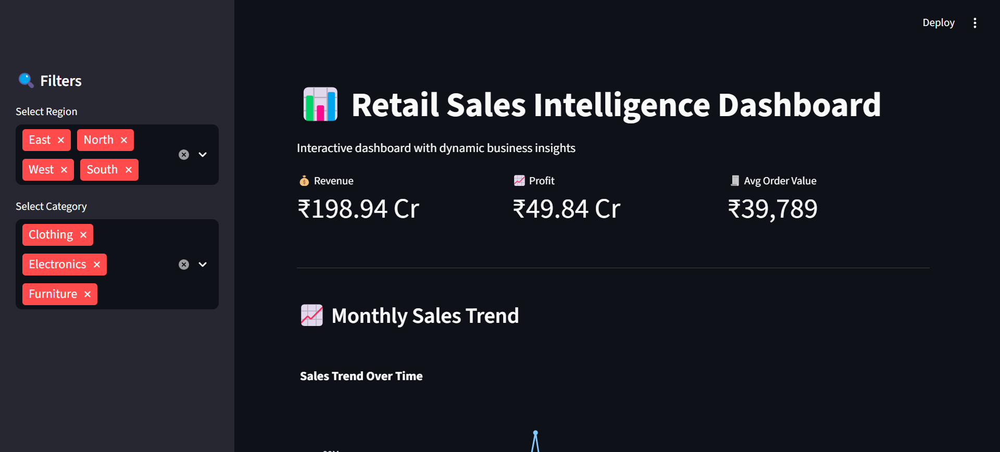
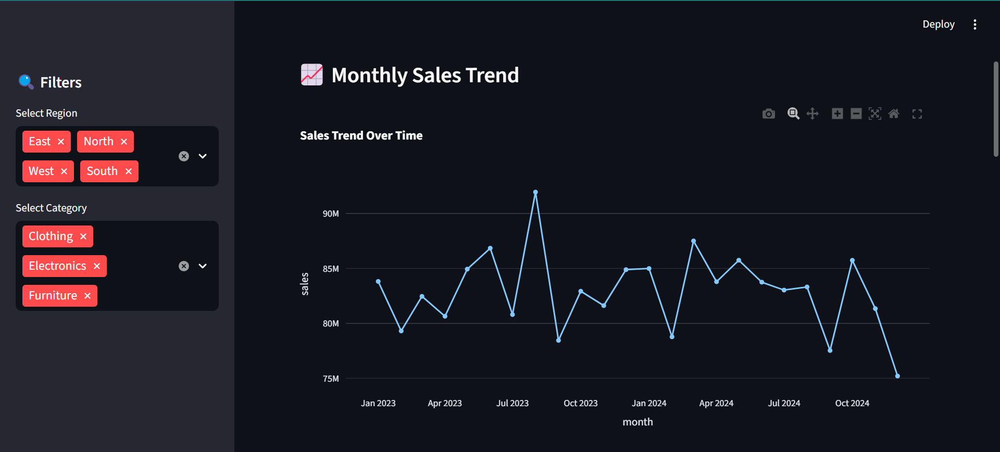
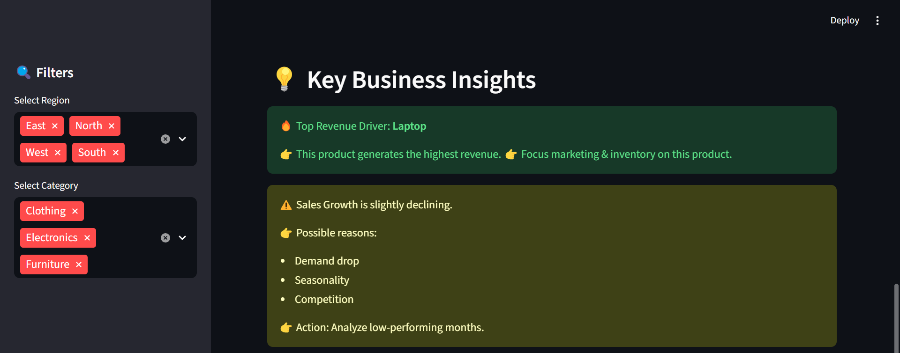

# 📊 Retail Sales Dashboard

An end-to-end sales analytics project where I built an interactive dashboard to analyze business performance and generate actionable insights from 50K+ transactions.



---

## Why I Built This

I wanted to go beyond just writing analysis in notebooks and actually ship something usable. So I challenged myself to build a full pipeline — generate data, clean it, analyze it, and present it through a proper dashboard that someone non-technical could actually use. This project is the result of that.

---

## What It Does

The dashboard lets you explore 50,000 retail transactions across 2 years (2023–2024). You can filter by region and product category in real time and instantly see how revenue, profit, and trends shift. It also auto-generates business insights — so instead of just showing charts, it tells you *what to do* based on the data.

---

## Screenshots

**KPI Overview + Filters**


**Monthly Sales Trend (Jan 2023 – Dec 2024)**



**Auto-Generated Business Insights Panel**



---

## Dataset

I generated this dataset synthetically using NumPy with realistic business logic baked in — for example, higher discounts automatically increase quantity sold, which is how real retail pricing works. The data covers 9 products across 3 categories and 4 regions over 730 days.

| Field | Details |
|---|---|
| Rows | 50,000 |
| Time Period | Jan 2023 – Dec 2024 |
| Categories | Electronics, Furniture, Clothing |
| Regions | North, South, East, West |
| Products | Laptop, Phone, Tablet, Sofa, Chair, Table, Shirt, Jeans, Jacket |

---

## Numbers That Came Out

| Metric | Value |
|---|---|
| Total Revenue | ₹198.94 Cr |
| Total Profit | ₹49.84 Cr |
| Orders Processed | 50,000 |
| Average Order Value | ₹39,789 |
| Profit Margin | 25.05% |
| Avg Monthly Growth | -0.25% |

---

## What I Found in the Data

- **Laptops drive 41% of all revenue** — single-handedly making Electronics the dominant category at 70% share
- **All 4 regions perform almost identically** — East leads by a small margin (₹50.6 Cr), showing uniform market distribution
- **20% discount tier sees higher volume but squeezed margins** — confirms that deep discounting isn't always worth it
- **Sales trend downward in late 2024** — visible in the line chart, likely a seasonality pattern worth monitoring in a real business context

---

## How to Run It

```bash
# 1. Clone the repo
git clone https://github.com/sakshiidulganti/sales-performance-dashboard.git
cd sales-performance-dashboard

# 2. Install requirements
pip install -r requirements.txt

# 3. Run notebooks in order (01 → 05)
jupyter notebook

# 4. Launch the dashboard
streamlit run dashboard/sales_dashboard.py
```

Opens at `http://localhost:8501`

---

## Stack

- **Python** — pandas, numpy, matplotlib, seaborn
- **Plotly** — interactive charts inside the dashboard
- **Streamlit** — dashboard framework
- **Jupyter** — notebooks for EDA and KPI work

---

## What I'd Add Next

- Date range slider filter on the dashboard
- Product-level drill-down page
- Sales forecasting using Prophet or ARIMA
- Deploy on Streamlit Cloud so it runs without local setup

---
##  What Problem This Solves

Businesses often struggle to understand:
- Which products drive revenue  
- Whether discounts actually improve profit  
- How sales trends change over time  

This dashboard helps answer these questions with clear visual insights.

## About Me

I'm Sakshi — an aspiring data analyst focused on SQL, Python, Excel, and Power BI. This is one of several projects where I'm building real end-to-end workflows rather than just isolated analyses.

- GitHub: [@sakshiidulganti](https://github.com/sakshiidulganti)
